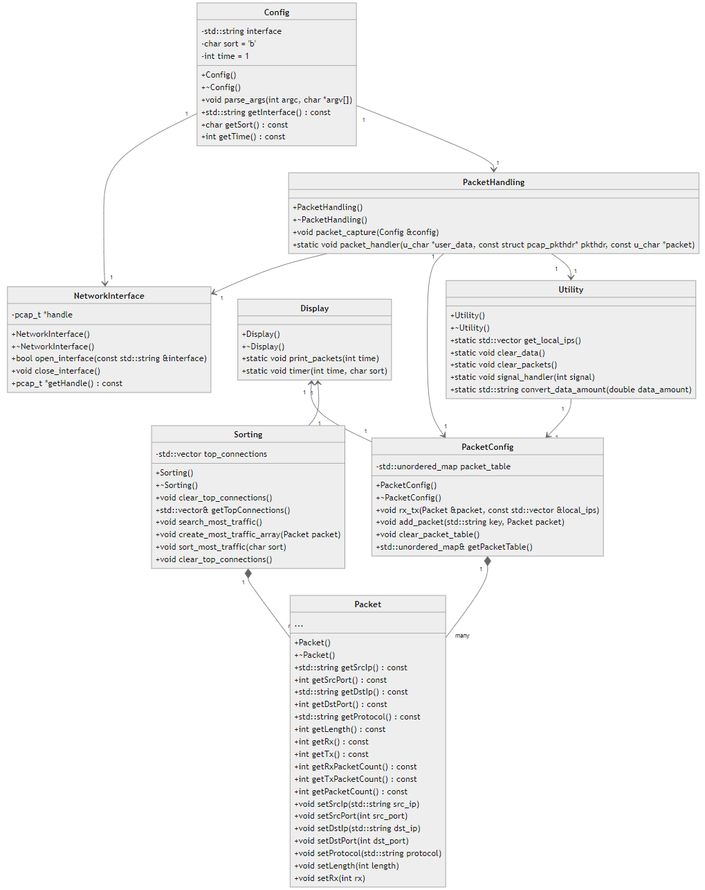

# Aplikace pro získání statistik o síťovém provozu

**Autor:** Tomáš Barták  
**Login:** xbarta51  
**Datum:** 15. 11. 2024

## Úvod

Náplní tohoto projektu je vytvořit konzolovou aplikaci pro zobrazení přenosových rychlostí jednotlivých spojení s názvem *isa-top*. Aplikace podporuje zachytávání přenosu na různých rozhraních a také řazení podle bitů či počtu paketů.

### Teorie k projektu

Pro práci na projektu je důležité znát nezbytnou teorii rozhraní, zachytávání paketů, z čeho se paket vůbec skládá, hlavičky různých protokolů a mnoho dalších.
Tato kapitola se tedy zaměřuje na vysvětlení podstatných pojmů nutných pro vytvoření tohoto projektu.

#### Rozhraní

Síťové rozhraní je v informatice označení pro fyzické nebo virtuální zařízení, které slouží jako propojení mezi počítačem a soukromou nebo veřejnou sítí.

#### Paket

Paket je označení bloku dat přenášených po síti. Každý paket se skládá z řídících dat a samotných uživatelských dat. Řídící data obsahují informace nezbytné pro doručení paketu na správné místo, k tomu je potřeba například zdrojová a cílová adresa, kódy pro detekci chyb. Tyto data se obvykle nalézají v hlavičkách paketů a na jejich konci. Uživatelská data se tedy zpravidla nacházejí mezi nimi.

#### Hlavičky paketů

Každý paket obsahuje hlavičku, která udává informace o obsahu paketu, zdroji, cíli a dalších informacích. Hlavička je obvykle strukturovaná a obsahuje různé pole, které obsahují informace o paketu. Hlavička může být různě dlouhá a obsahovat různé informace podle typu paketu.

#### Ethernetová hlavička

Obsahuje cílovou a zdrojovou MAC adresu, což je unikátní identifikátor síťového zařízení.

#### IP hlavička

Obsahuje informace o verzi IP, zdrojové IP adrese, cílové IP adrese atd. V dnešní době se používají dvě různé verze, a to IPv4 a IPv6. IPv4 je starší verze, která používá 32 bitové IPv4 adresy, zatímco IPv6 používá výrazně větší 128 bitové adresy, které však nejsou zpětně kompatibilní s IPv4.

#### TCP a UDP hlavička

Tyto hlavičky obsahují informace o zdrojových a cílových portech. Rozdíl mezi TCP a UPD hlavičkami je v tom, že TCP má 20-60 bytů dlouhou hlavičku, zatímco UDP má pouze 8 bytů. TCP zajišťuje spolehlivý přenos dat, zatímco UDP tuto záruku nemá, ale na úkor toho je rychlejší.

#### Protokoly

Tato podsekce obsahuje výběr často vyskytujících se protokolů.

#### ICMPv4

Internet Control Message Protocol je protokol, který je posílán v různých situacích, například pokud se data nepodaří doručit.

#### ICMPv6

ICMPv6 je Internet Control Message Protocol pro IPv6.

#### TCP

Transmission Control Protocol je protokol, který zajišťuje spolehlivý přenos dat.

#### UDP

User Datagram Protocol je protokol, který zajišťuje rychlý, ale nespolehlivý přenos dat.

## Návrh aplikace

Aplikace je rozvržena do tříd podle jejich funkcionality.

### Diagram tříd

### Soubor main

Hlavní tělo aplikace je obsaženo v souboru `main`, která zajišťuje čtení a zpracování argumentů předaných skrze příkazovou řádku. Zároveň se stará o otevření zvoleného rozhraní, začátku zachytávání paketů, či vytvoření druhého vlákna, které slouží k výpisu a jeho obnově na obrazovce terminálu a následné ukončení programu.

### Třída Config

Třída `Config` slouží primárně pro nastavení programu dle zadaných argumentů a jejich zpracování.

### Třída Display

Třída `Display` slouží k zobrazení a průběžné aktualizaci výstupů na obrazovku terminálu.

### Třída Globals

Třída `Globals` slouží převážně k zajištění, aby byla využita jedna instance vybraných mezi různými soubory.

### Třída NetworkInterface

Třída `NetworkInterface` v programu zajišťuje odposlech na konkrétním rozhraní zvolené uživatelem při spuštění programu.

### Třída PacketConfig

Třída `PacketConfig` pomáhá s ukládáním jednotlivých hodnot paketů do struktury *packet_table*.

### Třída PacketHandling

Třída `PacketHandling` zajišťuje samotné odchytávání a zpracovávání jednotlivých paketů.

### Třída Packet

Třída `Packet` slouží k nastavení hodnot do struktury paketu.

### Třída Sorting

Třída `Sorting` vypomáhá k zobrazení 10 spojení s nejvyšším přenosem dat a jejich řazení dle argumentu -s.

### Třída Utility

V neposlední řadě třída `Utility` obsahuje pomocné funkce pro vykonávání programu.

## Popis implementace

Tato kapitola se bude zabývat zajímavými pasážemi implementace programu a využití jednotlivých zajímavých částí programu.

### Metoda timer (Display třída)

Tato metoda probíhá na odlišném vlákně (*timer_thread*) od zbytku programu a stará se o obnovu obrazovky terminálu po časovém úseku zvoleného uživatelem prostřednictvím argumentu příkazové řádky terminálu. Tělo metody se opakuje dokud se nezmění hodnota *stop_flag* na false, což značí, že se uživatel snaží program ukončit. Tato metoda má za úkol vyčkávat pomocí funkce *sleep_for* po vteřinových úsecích do zvoleného intervalu. Zvolil jsem, aby cyklus probíhal po vteřinových úsecích, aby v případě, že je nastaven přepínač -t například na 10 sekund, tak aby se program přerušil nejpozději po vteřině od ukončení uživatelem a nečekal celých 10 vteřin. Po uplynutí tohoto časového intervalu nastaveného od uživatele se volají funkce pro vyhledání 10 spojení s největším přenosem dat a následně jejich seřazení podle přepínače -b. Nakonec je zavolána funkce *print_packets*, která tyto seřazené spojení zobrazí na obrazovku terminálu.

### Metoda packet_capture (PacketHandling třída)

V této metodě je funkce *pcap_loop*, která do přerušení zachytává pakety na rozhraní, které zvolil uživatel při spouštění programu a zpracovává je callback funkcí s názvem *packet_handler*, která se stará o zpracovávání těchto zachycených paketů. Zároveň je této callback funkci předána informace o lokálních IP adresách prostřednictvím ukazatele na tato data.

### Metoda get_local_ips (Utility třída)

Tato metoda slouží k získání všech IP adres lokálního stroje. Zvolil jsem tuto metodu pro určování, zda-li jsou přenášené pakety příchozí či odchozí. Pro inspiraci této metody sloužily návody. Prvně tato metoda získá seznam všech síťových rozhraní, které jsou následně procházeny v cyklu, dokud nedojde na konec seznamu síťových rozhraní. Uvnitř tohoto cyklu se převedené do řetězců (pomocí funkce *inet_ntop*) ukládají tyto adresy nalezené v rozhraních do proměnné *local_ips*.

## Informace o programu

Tato konzolová aplikace je napsána v jazyce C++, pro vytvoření bylo využito mnoho knihoven, mezi nejdůležitější patří základní knihovny jako například *iostream*, *string*, *vector*, následně pro zpracovávání paketů *pcap.h (libpcap)*,
*unordered_map* pro ukládání paketů do hash mapy, *ncurses* pro zobrazení výstupu na obrazovku terminálu a mnoho dalších.

Program slouží k výpočtu přenosových rychlostí mezi jednotlivými spojeními. Uživatel je schopen prostřednictvím příkazové řádky volit různá rozhraní pomocí přepínače *-i*. Lze také nastavit, zda-li má program řadit tyto spojení podle množství přenesených *bitů* či *paketů* nastavením přepínače *-s* na *b (pro bity)* nebo *p (pro počet paketů)*. V případě, že tento argument není uživatelem zvolen, pak program spojení řadí automaticky podle množství přenesených bitů. Posledním volitelným argumentem je přepínač *-t*, pomocí kterého lze zvolit intervaly pro aktualizaci výpisu spojení. V případě, že není zvolen, program výpis automaticky obnovuje každou vteřinu.

Program vypisuje vždy maximálně 10 spojení s nejvyšším množstvím přenesených bitů či paketů za stanovenou periodu.

Konzolová aplikace pracuje v promiskuitním módu a zachytává tedy jak komunikace s lokálním strojem, tak i zbytek komunikací na síti. Aplikace pracuje v promiskuitním módu pro případ, že například chceme měřit přenosové rychlosti na stroji, který slouží pouze pro přeposílání provozu, tedy pakety nebudou mít ani zdrojovou ani cílovou adresu shodující se s adresou lokální.

## Návod na použití

Aplikaci lze přeložit pomocí přiloženého *Makefile* souboru příkazem *make*. Po přeložení se vytvoří spustitelný soubor s názvem *isa-top*. Ten lze spouštět dvěma způsoby, a to buď pomocí výše zmíněného souboru Makefile příkazem *make run* nebo zadáním příkazu:

*sudo ./isa-top -i <interface_name> [-s <b | p>] [-t <interval_number>]*

Případně pro zobrazení nápovědy (přepínač *-h*):

*sudo ./isa-top -h*

Příkaz *sudo* je potřebný v případech, kdy bez něj není možné přistupovat k rozhraním.

Přepínač *-i* vyžaduje argument s názvem síťového rozhraní, na kterém chce uživatel zachytávat spojení.

Přepínač *-s* je volitelný a slouží k řazení spojení, a to buď podle bitů zadáním argumentu *b* a nebo podle počtu zachycených paketů zadáním argumentu *p*. V případě, že tento přepínač není uživatelem nastaven, program řadí výsledné spojení automaticky podle počtu přenesených bytů (stejně jako zadáním *-s b*).

Poslední přepínač *-t* je taktéž volitelným přepínačem a slouží k úpravě časového intervalu, který značí, jak často má program obnovovat zobrazování na obrazovku terminálu (aktualizaci statistik). Tento přepínač je navíc, byl využíván především pro účely manuálního testování, viz. níže.

## Testování aplikace

Pro testování základní komunikace programu a následné zobrazení síťové komunikace jsem využil základní nástroje jako například *ping*, *curl* či *wget*, případně také jejich IPv6 varianty *ping6* a *curl -g -6*. Tyto nástroje byly ze začátku velmi užitečné, protože byly velmi jednoduché na použití a zároveň testovaly různé protokoly. U každého jsem si uložil soubor ve formátu *pcap*, abych byl schopen tyto testy jednoduše opakovat prostřednictvím nástroje *tcpreplay*, který zachycenou komunikace z pcap souboru vygeneruje znovu bez nutnosti dalšího vytváření síťové komunikace. Tento příkaz se dá použít například následovně:

*sudo tcpreplay --intf1=<interface_name> <pcap_file_name>*

Dalším nástrojem pro testování programu byl nástroj *iperf3*, který dokáže simulovat TCP a UDP přenosy. Bylo potřeba v jednom terminálu nastavit server, který tuto komunikaci poslouchá a na dalším zařízení nastavit klient, který data odesílá. Tato data, zachycená pomocí aplikace Wireshark, byla následně uložena do souboru pcap pro opakování testů bez nutnosti zakládat znovu toto spojení.

Pro testování různých protokolů jsem využil také vytvořených skriptů v Pythonu komunikujících na rozhraní *lo (loopback)* s využitím knihovny *scapy*, pro generování jednotlivých paketů. Takto jsem testoval protokoly jako *ICMPv4*, *ICMPv6*, *IGMP*, *MLD*, *NDP*, *TCP* a *UDP*. Tyto skripty se dají jednoduše spustit příkazem 

*sudo python3 <nazev_skriptu>*

Všechny jsem si opět uložil jako pcap soubor pro opakování testování.

Posledním testovaným nástrojem byl externí nástroj *fast-cli*, který slouží ke změření rychlosti přenosu na daném zařízení. To slouží dobře i na generaci komunikace a její následné zobrazení. Opět byla tato komunikace během měření uložena do souboru *speed_test.pcap*.

## Výsledky testů

Provedené testy byly srovnávány s aplikací *Wireshark*. Protokoly odesílané manuálně pomocí Python skriptů se shodovaly jak na Wiresharku, tak v konzolové aplikaci *isa-top*. Podobně tomu bylo i u manuálních nástrojů jako například *curl*, *ping* či jejich IPv6 variantám. Při spuštění iperf3 pcap souboru a srovnání výstupu mezi aplikací *isa-top* a Wireshark statistikami z daného pcapu byly shodné.

Pro porovnání výsledků se statistikami Wiresharku z pcapu speed-test.pcap bylo potřeba zvýšit MTU (Maximum Transmission Unit), aby bylo schopné takové množství dat úspěšně poslat pomocí tcpreplay. Ovšem i tak je těžké porovnat výsledky s Wiresharkem, protože množství přenesených dat a množství vytvořených spojení je příliš velké, isa-top zobrazuje pouze 10 z nich s největším přenosem.